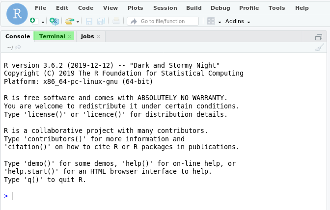
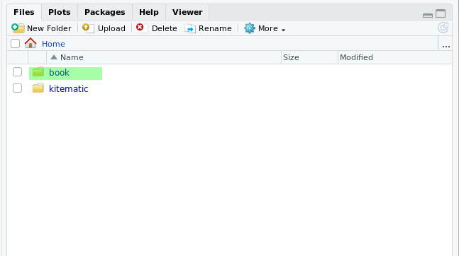
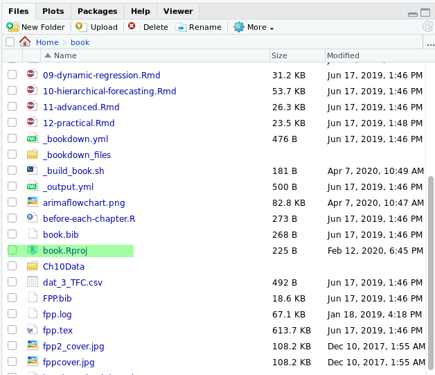
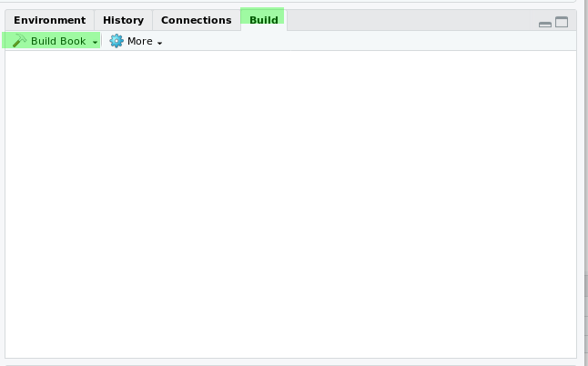

# Forecasting: Principles and Practice

This is a Docker container to build the book *Forecasting: Principles and Practice* from source using `bookdown`. This requires that you have Docker installed in your machine. There is Docker versions for Windows , Linux and MacOS.

The purpose of this container is:

1.  Learning how to run a Docker container with a fully functional project. In this case is a book built with the R package `bookdown.`
2.  Familiarize with the principles of **reproducibility**. This project and book are fully reproducible because:
    *   The book can be built exactly as the author originally did
    *   All the examples, datasets and code runs as was the original intention of the author
    *   All the examples, scripts, reports and plots can be reproduced. They should yield exactly the same results as the original project
    *   The project can be run and opened at any time, or in the future - let's say in couple of years-, and will run exactly as the original project
    *   Operating system dependencies (Windows, Linux, MacOS) and software dependencies (R packages) remain unobtrusive and do not interfere in the subsequent reruns of the project
    *   The original project remains unaltered if it is run again from the original image but the user can make changes inside the container and test new scenarios.
3.  Learning how to write notebooks with `Rmarkdown` and build electronic books with R `bookdown`.


## Build and run

Build with:

```
docker build  -f Dockerfile -t f0nzie/hyndman-bookdown .
```

Run with:

```
docker run --rm -p 8787:8787 -e PASSWORD=hyndman f0nzie/hyndman-bookdown
```

This will make available an RStudio session at:

<http://localhost:8787>


## View the book already built

Run the the container, opening a RStudio session at <http://localhost:8787/files/book/public/index.html>


## Build the book from scratch

Building a book from scratch means that all figures, caches, intermediate files created during a previous build are, or have been, removed, and we are starting their generation from the original sources, that is `Rmarkdown notebooks`.

There are different ways of building books from scratch:

### From the terminal

This runs a bash script that contains the following code:

```bash
#!/bin/sh

# remove folders using for building, if we want the book from scratch
rm -rf ./_bookdown_files/
# remove output folder as well
rm -rf ./public/

# build the book
Rscript -e "bookdown::render_book(input = 'index.Rmd', output_format = 'bookdown::gitbook', config_file = '_bookdown.yml')"
```

We will use the terminal tab from the RStudio container.

First, from your machine terminal open a RStudio session with 

```
docker run --rm -p 8787:8787 -e PASSWORD=hyndman f0nzie/hyndman-bookdown
```

Open a browser at <http://localhost:8787>

In the RStudio UI switch to the terminal:



Change to the folder `book` and run the script `_build_book.sh`. This will build the book from scratch.

```
cd book
./_build_book.sh
```

This will take about 10-15 minutes.


### Building the book from the RStudio Build tab

Another way to build the book is opening the book project and build it using the RStudio UI.

Click on the folder `book`




Click on the RStudio project `book.Rproj` and open it




Click on the tab `Build`, and click on `Build book`:



RStudio will build the book and will open the book within a browser at the end of the build process. This will take 10 to 15 minutes.


## References

*   [Rmarkdown]()
*   [bookdown]()
*   RStudio
*   GitHub repository with the container
*   DockerHub repository


